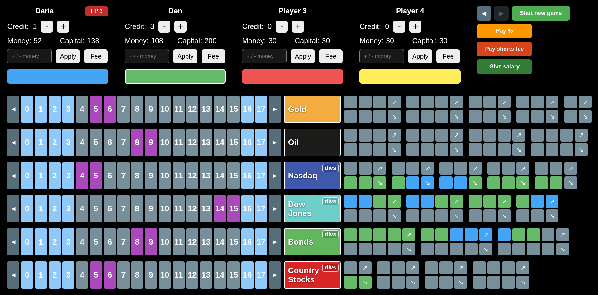

# Hulipolia

Hulipolia is a web-based stock market board game built with Rust and Dioxus. Players track cash, credit, positions, and market movement across six markets: Gold, Oil, Nasdaq, Dow Jones, Bonds, and Country Stocks.



## Stack

- Rust 2021
- Dioxus (`web`)
- CSS in `assets/main.css`
- Browser `localStorage` for persistence

## Features

- 4 player panels with editable names, money, and credit
- Buy and short position tracking per market
- Automatic cash changes when opening or closing positions
- Price marker shifting based on painted arrow cells
- Dividend payouts for Nasdaq, Dow Jones, Bonds, and Country Stocks
- Global actions for salary, credit interest, and shorts fees
- Undo/redo history
- Save/load through browser local storage

## Run

Prerequisites:

- Rust toolchain
- Dioxus CLI (`cargo install dioxus-cli`)

Development server:

```bash
dx serve
```

Release build:

```bash
dx build --release
```

Cargo build:

```bash
cargo build
```

The web build output is written to `dist/`.

## Project Layout

```text
.
├── assets/
│   └── main.css
├── docs/
│   └── conventions.md
├── src/
│   ├── components.rs
│   ├── config.rs
│   ├── history.rs
│   ├── main.rs
│   ├── market.rs
│   └── state.rs
├── Cargo.toml
└── Dioxus.toml
```

## Code Structure

- `src/main.rs`: application entry point
- `src/components.rs`: UI, signals, persistence, and game actions
- `src/state.rs`: player, cell, market, and history snapshot state
- `src/market.rs`: market construction and trading/price-shift logic
- `src/history.rs`: undo/redo stack
- `src/config.rs`: colors and static market configuration

## Game Concepts

Naming follows [`docs/conventions.md`](docs/conventions.md):

- `prices_cells`: left-side price scale for a market
- `holdings_cells`: top row of bought positions
- `shorts_cells`: bottom row of sold positions

Player capital is based on cash, credit, and painted positions.

## Persistence

Game state is stored in browser local storage under the key `hulipolia_game_state`. Reset clears the in-browser saved state.
